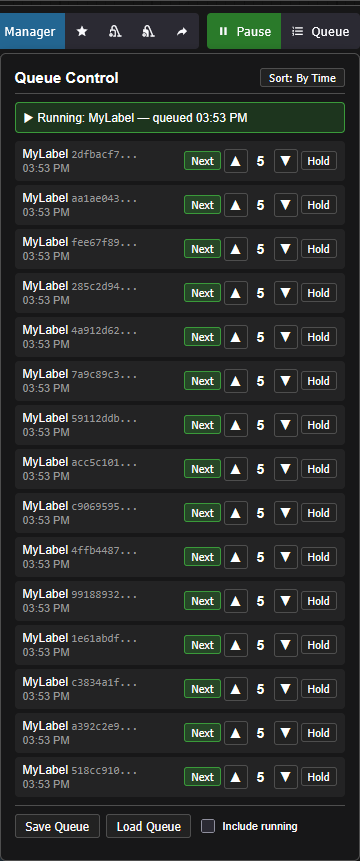
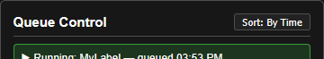
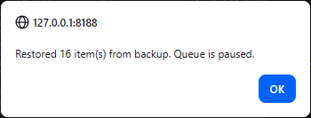
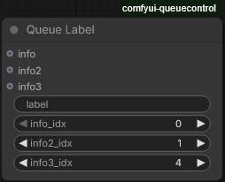
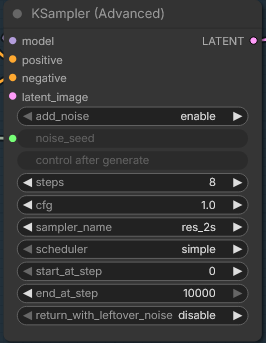

# ComfyUI-QueueControl

A ComfyUI extension helper for the bult-in Queue Manager that gives you more control over the job queue. You can pause/resume, change the run order, hold individual items, and save/load the entire queue to disk that survives a restart/reboot.



## Why?

ComfyUI's native queue is functional, but it runs first-in/first-out with no way to pause, reorder, or save anything. If you have 8 jobs queued and need to restart the server for a new custom node, you lose them all. If you realize job #3 should run before job #7, too bad. If you want to hold a few jobs while the rest run, there's no mechanism for that.

This extension addresses all of that without replacing ComfyUI's queue system. It patches the existing queue to add priority ordering and pause control, and provides a panel in the top bar to manage everything. <u>It does not load new dependencies</u>, so this won't break your Comfy install.

## Features

### Pause / Resume

 

A green **Pause** button in the top bar. Click it and the queue stops — the currently running job finishes normally, but nothing new starts. The button turns red and says **Resume**. Click again to release.

This is useful for more than just stopping the queue. If your workflow reads from a text/photo/video file and you realize the file has errors, you can pause, fix the file, and resume. Every remaining job will read the corrected version because ComfyUI resolves file reads at execution time, not at queue time.

### Priority System

This happens to me a lot: I submit 2/4/16/32 jobs and almost right away I realize that I want to run something quickly for a different project. With the priority system, you can submit a new job to the queue and bump it to the top. You can also set some jobs to be at the bottom so that they only run if there's nothing left ahead of it.

The Queue priorities go from **0** to **9**. Every job enters the queue at priority **5** (middle of the range). 

- **0** — Runs next, no matter what. Only one job can be priority 0 at any given time. Setting a new one bumps the old one to 1.
- **1–8** — Normal priorities. Lower number runs first. Within each numbered priority it goes back to first in, first out.
- **9** — On hold. Will not run even if the queue is otherwise empty. This is good for when you are stacking up jobs are are heading to lunch or bed or whatever in an hour but want to work on something else until then.

The queue panel shows all jobs with **▲/▼** buttons to nudge priority, a **Next** button to jump straight to priority 0, and a **Hold** button to set priority 9.

### Sort Toggle

 

The panel can display jobs sorted **By Time** (submission order) or **By Priority** (execution order). Time sort is the default — items stay in place while you change priorities, so you don't lose track of what you're editing. Setting the priorities is ***very*** rudimentary so take your time.

### Save / Load Queue


This happens to me as well: I submit a bunch of jobs and immediately realize I need to restart Comfy. For instance, I need to turn Sage on/off with a restart (ComfyUI-ReStartupFlags can hep with that >cough<), or maybe even want to reboot my computer first. Now, that's not a maddening experience.

**Save Queue** writes every queued item to a JSON file in the extension folder. Each job's full workflow data and priority are preserved. A checkbox lets you optionally include the currently running job.

**Load Queue** reads the file back and pushes the items into the queue at their saved priorities. Each item is validated on load — if a job references a node type or model that no longer exists, it gets loaded anyway but placed on hold (priority 9) so you can inspect it.

This is mainly for the restart scenario: save your queue, restart ComfyUI, load it back. But it's also handy as a general-purpose queue snapshot.

<u>Note:</u> If there are other jobs in the queue and you net the Load Queue button, it will load everything behind whatever is running. The extension never deletes the saved queue, so pressing it multiple times be hazardous!

**SECURITY WARNING:** The queue gets saved into the ComfyUI/custom_nodes/ComfyUI-QueueControl directory unencrypted. If you are the only user of the environment then no worries. However, if this is a shared machine the workflows in the queue could be exposed to other users which might be delicate for some users.

<u>Also note:</u> there is only one copy of the file. It was not intended to keep a lot of queues and I didn't want to always have to futz with names/opening a file every time. Having said that, I have been going over tot hat directory and doing all sorts of copy/rename/editing on the saved queues. 

### Persistent Queueing (Auto-save)

I saved the best for (second to) last. After some discussions with the Reddit community, it became clear that I missed a big feature. Version 1.1.0 now auto-saves the queue and will automatically restore it upon restart. If you have loaded the queue and your ComfyUI server fails for any reason (like when Windows just arbitrarily decided to update your system while you were sleeping) your queue will be restored when you restart. If it detects an unfinished queue and restores things, QueueControl will pause the queue and let you know what's going on.



This gives you a chance to think about what you want to do. Remember that you have the option to save it using the explicit save, so that id you had a lot of "overnight runs" that didn't complete you can save the queue and restart everything when the timing is better.

**SECURITY WARNING:** (The same note as queue saving.) The queue gets saved into the ComfyUI/custom_nodes/ComfyUI-QueueControl directory unencrypted. If you are the only user of the environment then no worries. However, if this is a shared machine the workflows in the queue could be exposed to other users which might be delicate for some users.

### Queue Label Node



One of the other frustrating things about the ComfyUI Queue is that it's very difficult to tell what job is what. I created this node to hep with that but it's only somewhat useful depending on what you are doing. The real issue is that most of the useful information that exists to identify a job only exists after it starts running, but not while it is waiting in the queue. (That's useful for other reasons but not for this.) The Queue Label node is a stand alone and doesn't need to be connected to anything.

**Queue Label** is simple node (under the **QueueControl** category) that **optionally** gives your workflow a name in the queue panel. It has two inputs:

- **label** — A text field you type into. This is whatever note you want to leave yourself. (This can also be connected to a node.)
- **info** — Optional inputs that accepts any type (string, number, etc.). Connect it to another node's output to include dynamic info.

If both are filled in, the panel shows like "Thing in info | Thing in info2 (Thing input to info port)" . Without the node, jobs show a truncated ID. 

**How to use the Queue Label node:**

I wanted this to be simple, but I also wanted it to be useful. So using this node effectively takes a few minutes to lean but it at least for me, it's very useful. First, you need to know a but about what information is available at submission time. For an example, l will use the KSampler (Advanced:)



So how do I get "sampler_name" into my info port?

Well, you start by connecting the LATENT port into the Queue Label node, then figure out which index the the right one. The is no hard and fast rule here but, the **<u>output indices are usually in the same order they are on the node and the indices always start at 0.</u>** So in our example above, what is index is "sampler_name"? 5? No, it's not 5. It's a trick question, because even though "sampler_name" is the 6th widget down, and indices start at 0, "control after generate" is skipped. It doesn't matter why, that's just how it is. To get "sampler_name" from that LATENT port, it's index 4 (as in the example).

So this is how I actually use it (and yes, I know it sounds "kludge-y"):

1. Set everything up the way I think it needs to be setup.
2. Pause the queue
3. Submit a job and check the Queue Control interface to see if the information is that way you want it.
4. If it's good, congratulations and move on.
5. If it's not, adjust the node and repeat steps 3-5 until I get what I want.

(1-5 is all encapsulated in "Just paly around with it. It's ComfyUI.")

Why I find this so useful: You can attach a lot of information to this. You can list the model, the image size, the sampler, the scheduler, etc. For scanning through jobs and deciding which ones run sooner than later, this is about the only wany to get it organized. 

**Note again:** The info input can only display values that are already written in the workflow at queue time - typed text, dropdown selections, fixed numbers. Anything that requires a node to compute (reading a file, generating a random number, processing text, computing a formula) won't be available because it hasn't executed yet.

## Installation

Install ComfyUI-QueueControl from **ComfyUI Manager**.

----or---

If you want to install it the manual way, clone or download this repo into your `ComfyUI/custom_nodes` directory:

```
cd ComfyUI/custom_nodes
git clone https://github.com/seeker-ktf/ComfyUI-QueueControl.git
```

Restart ComfyUI. A green **Pause** button and a **Queue** button should appear in the top bar.

No additional dependencies are required.

## How It Works

The extension patches two methods on ComfyUI's existing `PromptQueue` object:

- **`put()`** — Tags each incoming job with a priority-based sort key (default priority 5).
- **`get()`** — Blocks while paused, and skips priority-9 items even when the queue is otherwise empty.

Everything stays in ComfyUI's native queue — there's no separate queue or replacement system. The patches are installed on first use rather than at module load time to avoid interfering with ComfyUI's startup sequence.

The save files (`saved_queue.json`or `auto_backup.json`) contain the full workflow prompt data for each job, which is the same data ComfyUI uses internally to execute a workflow. Sensitive data (API keys, etc.) is stripped on save.

## Compatibility

This extension interacts directly with ComfyUI's queue internals, which means it could potentially break if ComfyUI significantly changes the `PromptQueue` class in `execution.py`. In practice, the queue structure has been stable because many other tools depend on it. If something does break after a ComfyUI update, the extension fails gracefully — the patch just doesn't install, and ComfyUI runs normally without the priority features.

## Change History

```
1.0.3	Fixed bug where clicking on the Queue button immmediatley after submit set all priorites to 0.
1.1.0	Added Persistent Queuing.
1.1.9	Added queue polling ever 2 seconds to force syncing in case of ip disruption on a remote setup.
1.2.1	Redesign the Queue Label node and redesign Persistent Queuing. Vesrion bump.
```


## License

Apache 2.0
